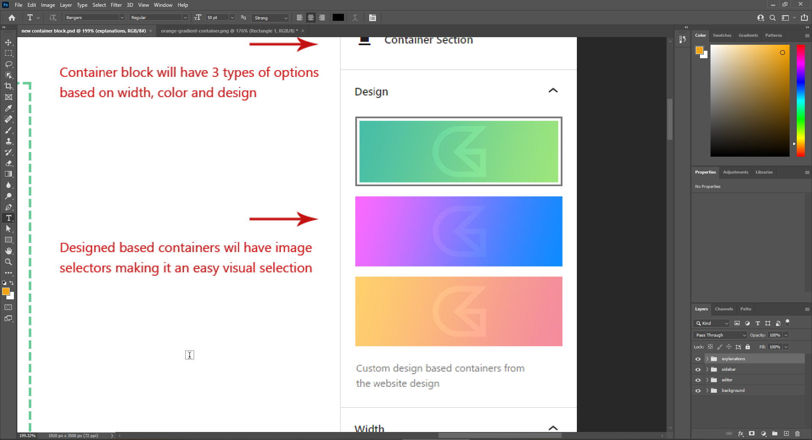

# Development in Gutenberg Container block

* [X] ~~*Swap the position of Background Design and Container width panel body*~~ [2021-09-15]
* [X] ~~*Update the bg color of container with a dashed border for a better look*~~ [2021-09-15]
* [X] ~~*Apply background images as selection points preview in Background Design panel body.*~~ [2021-09-15]

* [ ] Add the design selected, a specific border style to identify it is selected.
